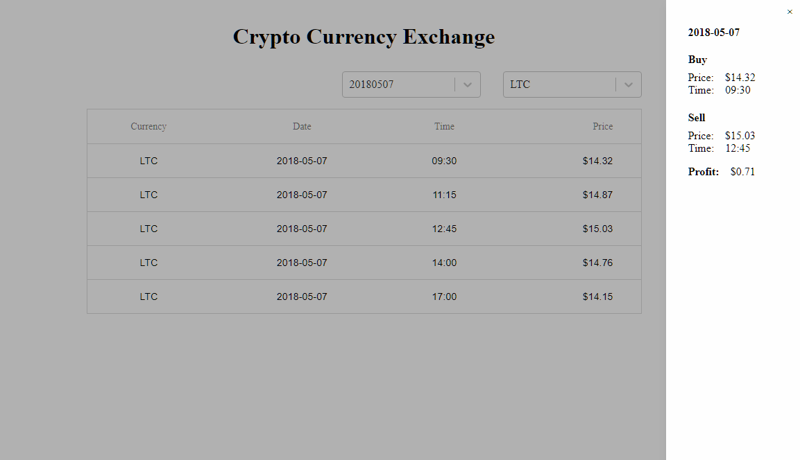
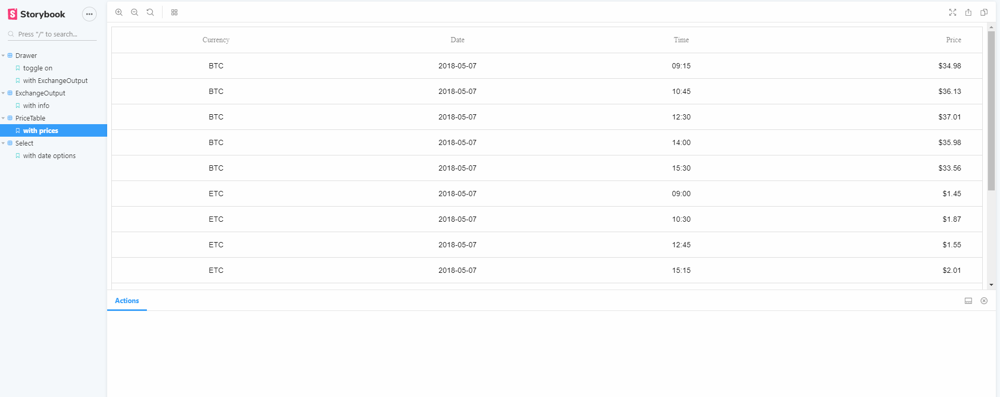

# Crypto Currency Exchange

## Prerequisite

Please install Node.js and MongoDB for this project. Please launch MongoDB before starting the project

## Start project

- Install and start the API server

  - `cd backend`
  - `npm install`
  - `npm start`

- In another terminal window, use Create React App to scaffold out the front-end
  - `cd frontend`
  - `npm install`
  - `npm start`

## Component library

You can run `npm run storybook` to check out the component library in frontend folder.

## Others

When clicking on each price, you can see a drawer sliding in showing the best profit you can make on the same day.
It is assumed that if the best profit we can make on that day is negative, then we do not sell the crypto currency.
